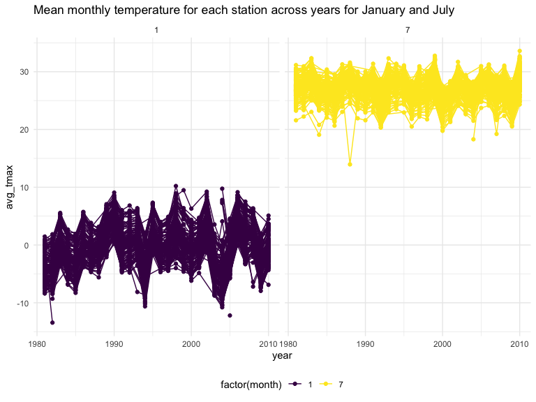
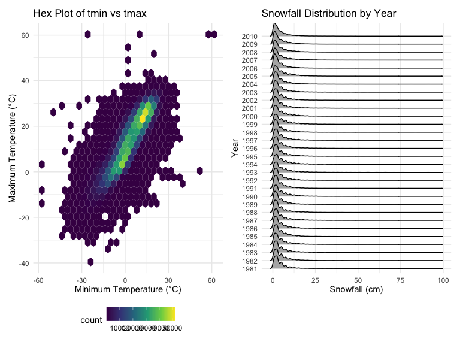

p8105_hw3_sw3455
================
Shiying Wu
2024-10-13

### Problem 1

``` r
data("ny_noaa")
ny_noaa <- ny_noaa |> 
  janitor::clean_names() |>
  separate(date, into = c("year", "month", "day"), convert = TRUE) |> 
  mutate(tmax = as.numeric(tmax) / 10,  
         tmin = as.numeric(tmin) / 10,
         prcp = prcp / 10, 
         snow = snow / 10 
        )

ny_noaa |>
  filter(!is.na(snow)) |>
  count(snow) |>
  arrange(desc(n))
```

    ## # A tibble: 281 × 2
    ##     snow       n
    ##    <dbl>   <int>
    ##  1   0   2008508
    ##  2   2.5   31022
    ##  3   1.3   23095
    ##  4   5.1   18274
    ##  5   7.6   10173
    ##  6   0.8    9962
    ##  7   0.5    9748
    ##  8   3.8    9197
    ##  9   0.3    8790
    ## 10  10.2    6552
    ## # ℹ 271 more rows

This dataset contains 2595176 rows and 9 columns.

id: Weather station identifier. date: Date of the observation. prcp:
Precipitation (tenths of mm). snow: Snowfall (mm). snwd: Snow depth
(mm). tmax: Maximum daily temperature (tenths of degrees C). tmin:
Minimum daily temperature (tenths of degrees C).

I clean the dataset by creating separate variables for year, month, and
day from the date column. I also convert tmax, tmin, precipitation, and
snowfall to appropriate units (Celsius for temperatures and centimeters
for snowfall). Upon examining snowfall, I find that 0 is the most
commonly observed value, which makes sense as snowfall does not occur on
most days in New York. The second most common value is NA, indicating
missing data. Other frequently observed values include 13, 25, and 51,
which suggest that snowfall was originally recorded in inches and later
converted to millimeters.

``` r
ny_noaa |> 
  filter(month %in% c(1, 7)) |> 
  group_by(id, year, month) |> 
  summarize(avg_tmax = mean(tmax, na.rm = TRUE)) |> 
  ggplot(aes(x = year, y = avg_tmax, group = id, color = factor(month))) + geom_point() + geom_path() +
  facet_grid(~month) +
  labs(title = "Mean monthly temperature for each station across years for January and July")
```

    ## `summarise()` has grouped output by 'id', 'year'. You can override using the
    ## `.groups` argument.


It generates a two-panel plot displaying the average maximum temperature
for each station in January and July across years. As expected, the
average temperature in January is significantly lower than in July for
all stations and over all years. The stations exhibit similar
temperature patterns, with synchronized peaks and troughs over time—when
one station records a high average temperature for a given year, most
other stations show similar behavior. However, there is one notably cold
outlier in July around 1987 or 1988, along with a few other smaller
deviations from the overall trend.

``` r
hex = 
  ny_noaa |> 
  ggplot(aes(x = tmin, y = tmax)) + 
  geom_hex() +
  labs(title = "Hex Plot of tmin vs tmax", x = "Minimum Temperature (°C)", y = "Maximum Temperature (°C)")

ridge = 
  ny_noaa |> 
  filter(snow < 100, snow > 0) |>
  ggplot(aes(x = snow, y = as.factor(year))) + 
  geom_density_ridges() +
  labs(title = "Snowfall Distribution by Year", x = "Snowfall (cm)", y = "Year")

hex + ridge
```

    ## Picking joint bandwidth of 0.622



This two-panel plot includes: (i) a hex plot of tmax versus tmin for the
full dataset, and (ii) a ridge plot showing the distribution of snowfall
values (in cm) greater than 0 and less than 100, broken down by year.

From the hex plot, I observe that while there is some variability in the
data, most of the observations are tightly clustered around the center
of the distribution. This suggests a strong correlation between minimum
and maximum temperatures. Interestingly, there are a few rare cases
where tmax is recorded as less than tmin, which points to potential
issues with data recording or quality.

The ridge plot shows a multimodal distribution of snowfall within each
year. Most stations report snowfall amounts between 0 and 4 cm. This
pattern aligns with the earlier observation of common snowfall values in
the dataset.

### Problem 2

``` r
nhanes_accel <- read_csv("data/nhanes_accel.csv", 
                         na = c(".", "NA", "")) |>
                janitor::clean_names()
```

    ## Rows: 250 Columns: 1441
    ## ── Column specification ────────────────────────────────────────────────────────
    ## Delimiter: ","
    ## dbl (1441): SEQN, min1, min2, min3, min4, min5, min6, min7, min8, min9, min1...
    ## 
    ## ℹ Use `spec()` to retrieve the full column specification for this data.
    ## ℹ Specify the column types or set `show_col_types = FALSE` to quiet this message.

``` r
nhanes_covar <- read_csv("data/nhanes_covar.csv",
                         skip = 4,
                         na = c(".", "NA", "")) |> 
                janitor::clean_names()|>
                filter(age >= 21) |> 
                na.omit() |> 
                mutate(sex = factor(sex, levels = c("1", "2"), labels = c("Male", "Female")),
                       education = factor(education, levels = c("1", "2", "3"),
                       labels = c("Less than High School", "High School Equivalent", "More than High School")))
```

    ## Rows: 250 Columns: 5
    ## ── Column specification ────────────────────────────────────────────────────────
    ## Delimiter: ","
    ## dbl (5): SEQN, sex, age, BMI, education
    ## 
    ## ℹ Use `spec()` to retrieve the full column specification for this data.
    ## ℹ Specify the column types or set `show_col_types = FALSE` to quiet this message.

``` r
nhanes_merged <- left_join(nhanes_covar, nhanes_accel, by = "seqn")
```

For problem 2, I import data using `read_csv` and clean names using
`janitor::clean_names()`. Then, I filtering out individuals under 21 and
removing any rows with missing demographic data and change categorical
number into what it means. The final step, I used left join to merges
demographic and accelerometer data, which all the one in nhanes_accel
data that does not have demographic data will be removed. This dataset
contains 228 rows and 1445 columns. Variables include seqn, sex, age,
bmi, education, min1 and more.

``` r
nhanes_merged |>
  group_by(education, sex) |>
  summarise(n_obs = n()) |>
  pivot_wider(
    names_from = sex,
    values_from = n_obs) |> 
  knitr::kable()
```

    ## `summarise()` has grouped output by 'education'. You can override using the
    ## `.groups` argument.

| education              | Male | Female |
|:-----------------------|-----:|-------:|
| Less than High School  |   27 |     28 |
| High School Equivalent |   35 |     23 |
| More than High School  |   56 |     59 |

After I `group_by` education and sex, I used summarise to calculated the
number of observations for each group. Following this, I make the table
wider by `pivot_wider` for more tidyness as sex to be column and
education to be row. Finaly rendered into a reader-friendly table using
`knitr::kable()`.

The table shows a similar number of females and males at both
`Less than High School` and `More than High School`, the gender
disparity is similar when we think about education both
`Less than High School` and `More than High School`. In contrast, more
males than females have a `High School Equivalent` education. It is a
worth to study question that why such big difference appear only in high
school equivalent education

``` r
nhanes_merged|>
  select(age, sex, education)|>
  ggplot(aes(x = age, fill = sex)) +
  geom_density(alpha = 0.4, adjust = 0.5) + 
  facet_wrap(~ education) +
  labs(title = "Age Distribution by Sex and Education", 
       x = "Age", 
       y = "Density") + 
  viridis::scale_fill_viridis(discrete = TRUE)
```


I used the nhanes_merged dataset to explore the age distribution by sex
and education level by density plots. By selecting the variables that we
looking for (age, sex, and education), and plotting age as a density
function with color of sex, and put education in different panel for
more easy to understand the difference.

Both genders show a peak in young age groups in `More than High School`,
which lead to a higher proportion of younger individuals pursuing higher
education. But the female also has higher density in young age groups.

For `High School Equivalent` education, the female and male are opposite
to each other. When male are high in young age group, female are lower
than male, but in old age group, the women has higher density.

The `Less than High School`, gender are similar to each other. age group
amount 60 has a low density compare to other age group that close to it.

``` r
nhanes_merged |>
  rowwise() |>
  mutate(total_activity = sum(c_across(starts_with("min")))) |>
  ggplot(aes(x = age, y = total_activity, color = sex)) +
  geom_point(alpha = 0.5) +
  geom_smooth(se = FALSE) +
  facet_wrap(~ education) +
  labs(title = "Total Daily Activity vs Age by Sex and Education Level",
       x = "Age", 
       y = "Total Activity") + 
  viridis::scale_fill_viridis(discrete = TRUE) +
  theme(legend.position = "bottom")
```

    ## `geom_smooth()` using method = 'loess' and formula = 'y ~ x'


In the analysis, I sum all activity start with “min” data, then use
ggplot’s `geom_point` and `geom_smooth` visualized this total activity
against age by both point and lines, while use sex as color and put in
different panels by education level.

Activity peaks in mid-life across all educational backgrounds,
suggesting a higher engagement in physical activity among middle-aged
adults. Males generally showing slightly higher activity levels in less
than high school education while men are older then 40, in other
education and age all showes women has higher total activity. The trend
lines, shows a overall decrease in activity as age increases.

``` r
nhanes_merged |>
  pivot_longer(cols = starts_with("min"), names_to = "minute", values_to = "activity") |>
  mutate(minute = as.numeric(str_extract(minute, "\\d+"))) |>
  ggplot(aes(x = minute, y = activity, color = sex)) +
  geom_line(size = 0.1, alpha =  0.5) +
  geom_smooth(se = FALSE, size = 1) +
  facet_wrap(~ education) +
  labs(title = "24-hour Activity Time Courses by Education Level and Sex", y = "Activity", x = "Minutes of 24 Hours") + 
  viridis::scale_fill_viridis(discrete = TRUE) +
  theme(legend.position = "none")
```

    ## `geom_smooth()` using method = 'gam' and formula = 'y ~ s(x, bs = "cs")'


I transformed data into a long format to easier analyze 24-hour activity
patterns by using pivot_longer. The plot is faceted by education level,
and lines represent activity over time for males and females. x for
minute and y for activity in every minuts to show the overall activity
for each data.

The 24-hour activity patterns by education level and sex, showing a
similarity of activity peaking midday and low at begining of the day
which is midnight across all groups. The differences between males and
females are small, female has slightly higher activity peaks in all
education group. More than High School education, female seems has
bigger difference with male in midday than other two education group.
Individuals with less than high school education tend to have higher
peaks around 700 minuts which is around 11:30 AM.

### Problem 3

``` r
Jan2020Citi <- read_csv("data/citibike/Jan 2020 Citi.csv", 
                         na = c(".", "NA", "")) |>
                janitor::clean_names() |>
                mutate(year = 2020,
                       month = "Jan") 
```

    ## Rows: 12420 Columns: 7
    ## ── Column specification ────────────────────────────────────────────────────────
    ## Delimiter: ","
    ## chr (6): ride_id, rideable_type, weekdays, start_station_name, end_station_n...
    ## dbl (1): duration
    ## 
    ## ℹ Use `spec()` to retrieve the full column specification for this data.
    ## ℹ Specify the column types or set `show_col_types = FALSE` to quiet this message.

``` r
Jan2024Citi <- read_csv("data/citibike/Jan 2024 Citi.csv", 
                         na = c(".", "NA", "")) |>
                janitor::clean_names()|>
                mutate(year = 2024,
                       month = "Jan") 
```

    ## Rows: 18861 Columns: 7
    ## ── Column specification ────────────────────────────────────────────────────────
    ## Delimiter: ","
    ## chr (6): ride_id, rideable_type, weekdays, start_station_name, end_station_n...
    ## dbl (1): duration
    ## 
    ## ℹ Use `spec()` to retrieve the full column specification for this data.
    ## ℹ Specify the column types or set `show_col_types = FALSE` to quiet this message.

``` r
July2020Citi <- read_csv("data/citibike/July 2020 Citi.csv", 
                         na = c(".", "NA", "")) |>
                janitor::clean_names()|>
                mutate(year = 2020,
                       month = "July") 
```

    ## Rows: 21048 Columns: 7
    ## ── Column specification ────────────────────────────────────────────────────────
    ## Delimiter: ","
    ## chr (6): ride_id, rideable_type, weekdays, start_station_name, end_station_n...
    ## dbl (1): duration
    ## 
    ## ℹ Use `spec()` to retrieve the full column specification for this data.
    ## ℹ Specify the column types or set `show_col_types = FALSE` to quiet this message.

``` r
July2024Citi <- read_csv("data/citibike/July 2024 Citi.csv", 
                         na = c(".", "NA", "")) |>
                janitor::clean_names()|>
                mutate(year = 2024,
                       month = "July") 
```

    ## Rows: 47156 Columns: 7
    ## ── Column specification ────────────────────────────────────────────────────────
    ## Delimiter: ","
    ## chr (6): ride_id, rideable_type, weekdays, start_station_name, end_station_n...
    ## dbl (1): duration
    ## 
    ## ℹ Use `spec()` to retrieve the full column specification for this data.
    ## ℹ Specify the column types or set `show_col_types = FALSE` to quiet this message.

``` r
Citi_df <- bind_rows(Jan2020Citi, Jan2024Citi, July2020Citi, July2024Citi) |>
  relocate(year, month, weekdays)
```

I read each csv file independently and clean their name and mutate the
year and month variable in order for us to know when is the dataset come
from. Then use bind rows to combine all four dataset together. The final
dataset, Citi_df, contains ride duration, start and end times, station
ID, rideable_type, and user type (member or casual user). I placing the
most relevant time variables (year, month) first, for tidyness.This
dataset contains 99485 rows and 9 columns. Variables include year,
month, weekdays, ride_id, rideable_type, duration, start_station_name,
end_station_name, member_casual.

``` r
Citi_df |>
  mutate(date = paste(year, month, sep=" ")) |>
  group_by(date, member_casual) |>
  summarise(number_of_rides = n()) |> 
  pivot_wider(
    names_from = member_casual, 
    values_from = number_of_rides) |>
  knitr::kable()
```

    ## `summarise()` has grouped output by 'date'. You can override using the
    ## `.groups` argument.

| date      | casual | member |
|:----------|-------:|-------:|
| 2020 Jan  |    984 |  11436 |
| 2020 July |   5637 |  15411 |
| 2024 Jan  |   2108 |  16753 |
| 2024 July |  10894 |  36262 |

I put the year and month together as date for more reader friendly
table, then I group by date and rider type and in order for total number
of it. Eventually, I pivot wider to make rider type as column and date
as row and use knitr::kable() clean table.

There are several difference, the member has more rides than casual.
Also there are more rides in july than Jan may due to it is warmer and
also 2024 clearly has more rides than 2020.

``` r
Citi_df |>
  filter(year == 2024, month == "July") |>
  group_by(start_station_name) |>
  summarise(number_of_rides = n()) |>
  arrange(desc(number_of_rides)) |>
  head(n = 5) |>
  knitr::kable()
```

| start_station_name       | number_of_rides |
|:-------------------------|----------------:|
| Pier 61 at Chelsea Piers |             163 |
| University Pl & E 14 St  |             155 |
| W 21 St & 6 Ave          |             152 |
| West St & Chambers St    |             150 |
| W 31 St & 7 Ave          |             146 |

I first filter 2024 july dataset, then group data by start_station_name
and summarise how many rides happen in each start station, and by
arrange it from more to less, first 5 would be the top 5 popular start
station we looking for.

``` r
Citi_df |>
  group_by(year, month, weekdays) |>
  summarise(median_ride_duration = median(duration)) |>
  ggplot(aes(x = weekdays, y = median_ride_duration, group = interaction(year, month), color = month)) +
  geom_line() +
  facet_wrap(~year) +
  scale_x_discrete(limits = c("Monday", "Tuesday", "Wednesday", "Thursday", "Friday", "Saturday", "Sunday")) +
  labs(title = "Median Ride Duration Across Different Times") +
  theme(axis.text.x = element_text(angle = 45, hjust = 1))  
```

    ## `summarise()` has grouped output by 'year', 'month'. You can override using the
    ## `.groups` argument.


I group by year month and weekdays in order to get median_ride_duration
for each times. then use month as color, weekdays as x and seperate as
two panels by year. On the graph, we can clearly see that 2020 has
significant larger median ride duration than 2024 overall. For 2020 jan
, july and 2024 july, the weekend has higher median ride duration than
work days, but for 2024 jan, it is more stable. Overall, as monday to
sunday, the overall trend are increasing.

``` r
Citi_df |>
  filter(year == 2024) |>
  ggplot(aes(x = duration, fill = member_casual)) +
  geom_histogram(position = "identity", alpha = 0.7) +
  facet_wrap(month~rideable_type) +
  labs(title = "Impact on Ride Duration in 2024")
```

    ## `stat_bin()` using `bins = 30`. Pick better value with `binwidth`.


I filtered the 2024 Citi Bike data to focus on ride durations,
categorized by membership status (member & casual) and bike type
(classic & electric). Using ggplot, I created histograms to visually
compare the distributions of ride durations within these categories. The
histograms are displayed separately for each bike type through the use
of facet_wrap, highlighting differences in usage patterns between
classic and electric bikes. Members in general show higher duration than
casual overall. For Electric bikes, both member and casual riders of
electric bikes tend to have longer ride durations compared to those
using classic bikes. July has longer duration than Jane overall. Both
distributioon are really skewness. Also the majority of duration is with
50, a lot of people took it as a short trip.
